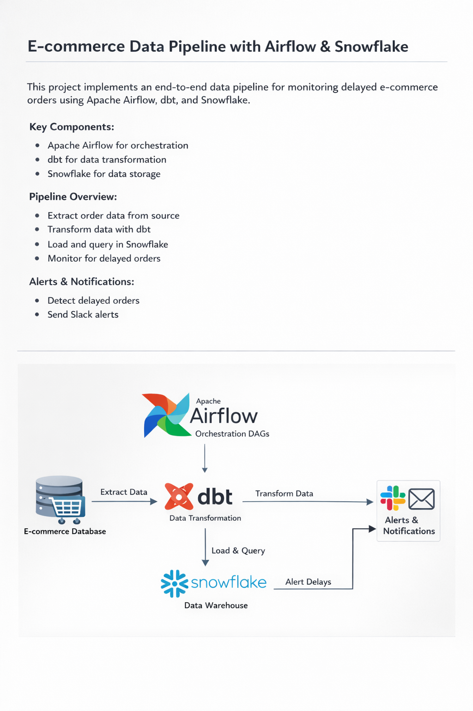

# 🚀 E-commerce Data Pipeline – Airflow, dbt & Snowflake

## 📌 Project Overview

This project implements an end-to-end modern data pipeline for monitoring delayed e-commerce orders.

The pipeline orchestrates data transformations using **Apache Airflow**, transforms data with **dbt**, and stores analytics-ready datasets in **Snowflake**.

The system detects delayed shipments and can trigger alerts for monitoring purposes.

---

## 🏗️ Architecture

**Main Components:**

- Apache Airflow → Workflow orchestration
- dbt → Data transformation layer
- Snowflake → Cloud Data Warehouse
- Docker → Containerized environment

---

## 🔄 Pipeline Flow

1. Extract raw data (orders, shipments, customers)
2. Transform data using dbt models
3. Create analytical view `ORDERS_STATUS`
4. Detect delayed orders (delivery > 48 hours)
5. Trigger monitoring checks

---

## 📊 Business Logic

A delivery is considered **DELAYED** when:
